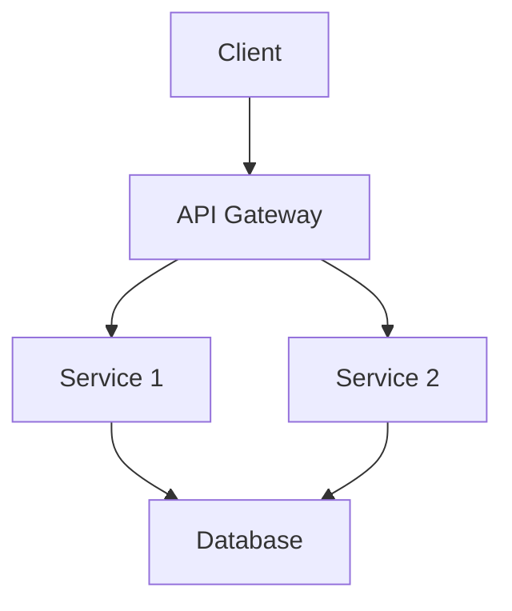
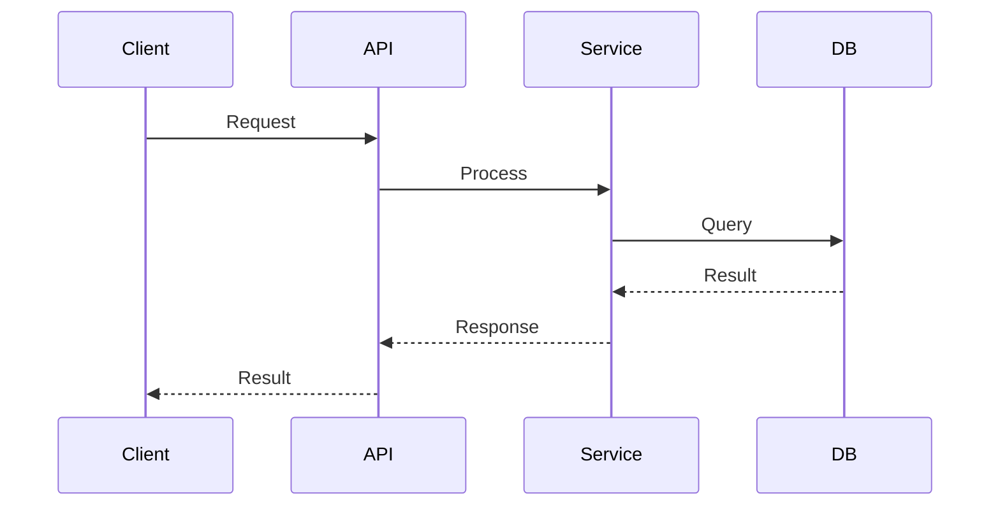
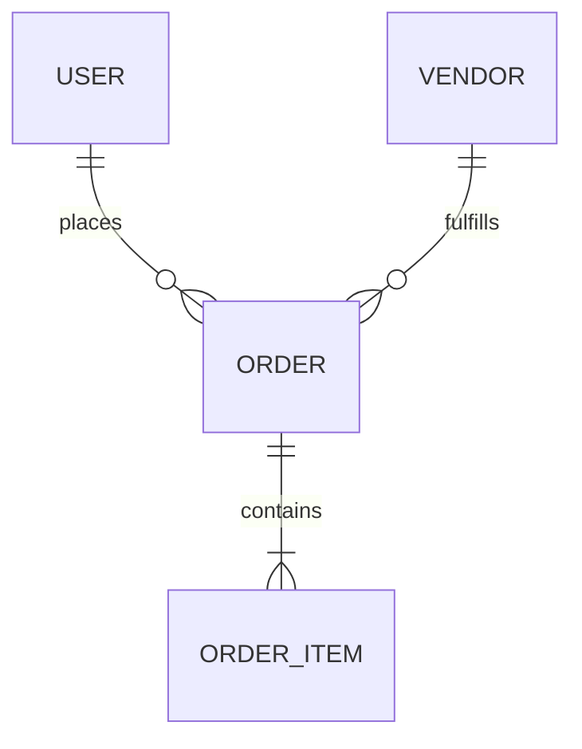

# Technical Design: [Feature Name]

**Author:** [Name] | **Email:** [email@tukshopp.ng]  
**Date:** [YYYY-MM-DD]  
**Status:** [Draft | In Review | Approved | Implemented]  
**Reviewers:** [Name1, Name2, Name3]

---

## Metadata

- **Related Feature Spec:** [Link to product spec]
- **RFC:** [Link to RFC if applicable]
- **JIRA/Linear Ticket:** [Link]
- **Target Release:** [Version]

---

## 📋 Table of Contents

1. [Context](#context)
2. [Goals & Non-Goals](#goals--non-goals)
3. [Proposed Solution](#proposed-solution)
4. [Alternative Solutions](#alternative-solutions)
5. [System Design](#system-design)
6. [API Design](#api-design)
7. [Data Model](#data-model)
8. [Security Considerations](#security-considerations)
9. [Performance Considerations](#performance-considerations)
10. [Testing Strategy](#testing-strategy)
11. [Rollout Plan](#rollout-plan)
12. [Monitoring & Alerts](#monitoring--alerts)
13. [Dependencies](#dependencies)
14. [Open Questions](#open-questions)

---

## 📖 Context

### Background
What is the current state? What problem are we solving?

### Problem Statement
Clearly define the problem this design solves.

### Assumptions
List any assumptions made in this design.

---

## 🎯 Goals & Non-Goals

### Goals
What we're trying to achieve:
1. Goal 1
2. Goal 2
3. Goal 3

### Non-Goals
What we're explicitly NOT doing:
1. Non-goal 1
2. Non-goal 2

### Success Metrics
How we'll measure success:
- Metric 1: Target
- Metric 2: Target

---

## 💡 Proposed Solution

### High-Level Overview
Brief description of the proposed solution (2-3 paragraphs).

### Key Components
1. **Component 1**
   - Purpose
   - Responsibilities

2. **Component 2**
   - Purpose
   - Responsibilities

### Architecture Diagram
```
[Include architecture diagram here using Mermaid or link to diagram]
```



---

## 🔄 Alternative Solutions

### Alternative 1: [Name]
**Description:** Brief description

**Pros:**
- Pro 1
- Pro 2

**Cons:**
- Con 1
- Con 2

**Why Not Chosen:** Explanation

### Alternative 2: [Name]
**Description:** Brief description

**Pros:**
- Pro 1
- Pro 2

**Cons:**
- Con 1
- Con 2

**Why Not Chosen:** Explanation

---

## 🏗️ System Design

### Component Breakdown

#### Component 1: [Name]
**Responsibility:** What this component does

**Interface:**
```typescript
interface ComponentInterface {
  method1(param: Type): ReturnType;
  method2(param: Type): ReturnType;
}
```

**Implementation Details:**
- Detail 1
- Detail 2

#### Component 2: [Name]
[Similar structure]

### Sequence Diagram



### Data Flow

Explain how data flows through the system.

---

## 🔌 API Design

### New Endpoints

#### POST /api/v1/resource
**Description:** What this endpoint does

**Request:**
```json
{
  "field1": "value",
  "field2": 123
}
```

**Response (200 OK):**
```json
{
  "success": true,
  "data": {
    "id": "resource_123",
    "field1": "value"
  }
}
```

**Error Responses:**
- `400 Bad Request` - Invalid input
- `401 Unauthorized` - Not authenticated
- `500 Internal Server Error` - Server error

### Modified Endpoints

#### PUT /api/v1/existing-resource/{id}
**Changes:** What's changing

**New Fields:**
- `field_name`: Description

**Deprecated Fields:**
- `old_field`: Deprecation timeline

### Breaking Changes

List any breaking API changes and migration path.

---

## 💾 Data Model

### Database Schema

#### New Tables/Collections

**table_name**
```sql
CREATE TABLE table_name (
  id VARCHAR(255) PRIMARY KEY,
  field1 VARCHAR(255) NOT NULL,
  field2 INTEGER DEFAULT 0,
  created_at TIMESTAMP DEFAULT CURRENT_TIMESTAMP,
  updated_at TIMESTAMP DEFAULT CURRENT_TIMESTAMP ON UPDATE CURRENT_TIMESTAMP,
  INDEX idx_field1 (field1)
);
```

#### Schema Modifications

**Existing table: users**
- Add column: `new_field VARCHAR(255)`
- Modify column: `old_field` change type to INT
- Add index: `idx_new_field`

### Entity Relationships



### Data Migration

**Migration Steps:**
1. Step 1
2. Step 2
3. Step 3

**Rollback Plan:**
1. Rollback step 1
2. Rollback step 2

---

## 🔐 Security Considerations

### Authentication & Authorization
- Who can access this feature?
- What permissions are required?

### Data Privacy
- What personal data is handled?
- GDPR/compliance requirements
- Data retention policies

### Security Risks
| Risk | Severity | Mitigation |
|------|----------|------------|
| Risk 1 | High/Medium/Low | Mitigation strategy |

### Security Testing
- Penetration testing requirements
- Security review checklist

---

## ⚡ Performance Considerations

### Expected Load
- Requests per second: X
- Concurrent users: Y
- Data volume: Z

### Performance Targets
- API response time: <Xms
- Database query time: <Yms
- Throughput: X req/sec

### Optimization Strategies
1. **Caching**
   - What to cache
   - Cache invalidation strategy
   - TTL

2. **Database Optimization**
   - Indexes
   - Query optimization
   - Connection pooling

3. **Scaling Strategy**
   - Horizontal scaling
   - Load balancing
   - Bottleneck mitigation

### Performance Testing
- Load testing plan
- Stress testing scenarios

---

## 🧪 Testing Strategy

### Unit Tests
- Components to test
- Coverage target: X%

### Integration Tests
- Integration scenarios
- Test environments

### End-to-End Tests
- User flows to test
- Critical paths

### Test Data
- Test data requirements
- Data generation strategy

---

## 🚀 Rollout Plan

### Phase 1: Development
- [ ] Implementation
- [ ] Unit tests
- [ ] Code review

### Phase 2: Staging
- [ ] Deploy to staging
- [ ] Integration testing
- [ ] QA approval

### Phase 3: Production
- [ ] Feature flag setup
- [ ] Gradual rollout: 5% → 25% → 50% → 100%
- [ ] Monitoring
- [ ] Full release

### Rollback Strategy
Steps to rollback if issues arise:
1. Step 1
2. Step 2

---

## 📊 Monitoring & Alerts

### Metrics to Track
- Metric 1: Description, threshold
- Metric 2: Description, threshold

### Dashboards
- Dashboard 1: Purpose, link
- Dashboard 2: Purpose, link

### Alerts
| Alert | Condition | Severity | Action |
|-------|-----------|----------|--------|
| Alert 1 | Condition | Critical/Warning | Who to notify, what to do |

### Logging
- What events to log
- Log levels
- Retention period

---

## 🔗 Dependencies

### Internal Dependencies
- Service/Feature 1: Why needed, owner
- Service/Feature 2: Why needed, owner

### External Dependencies
- Third-party service 1: Purpose, fallback
- Third-party service 2: Purpose, fallback

### Timeline Dependencies
- Dependency 1 must be complete by [date]

---

## ❓ Open Questions

1. **Question 1**
   - Context
   - Decision needed by: [date]
   - Owner: [name]

2. **Question 2**
   - Context
   - Decision needed by: [date]
   - Owner: [name]

---

## 📝 Decision Log

| Date | Decision | Rationale | Decided By |
|------|----------|-----------|------------|
| YYYY-MM-DD | Decision summary | Why this was chosen | Name |

---

## 👥 Review & Approval

### Reviewers
- [ ] @engineer1 - Service expertise
- [ ] @engineer2 - Security review
- [ ] @engineer3 - Performance review
- [ ] @engineering-lead - Final approval

### Review Comments
[Comments and feedback during review process]

---

## 📚 References

- [Related Design Doc 1]
- [Architecture Decision Record]
- [External Resource]
- [Research Paper]

---

## 📎 Appendix

### Glossary
- **Term 1**: Definition
- **Term 2**: Definition

### Code Examples
```typescript
// Relevant code examples
```

---

**Last Updated:** [Date]  
**Status:** [Current Status]

