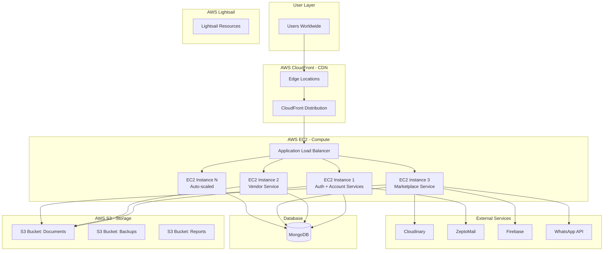
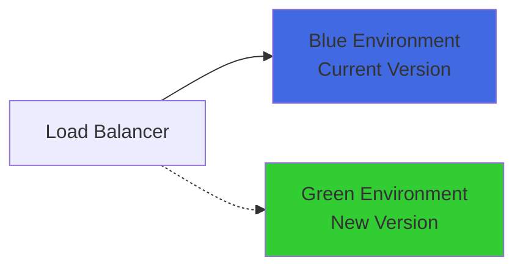

# TukShopp Infrastructure Architecture

**Cloud Provider:** AWS (Amazon Web Services)  
**Version:** 1.0  
**Last Updated:** November 11, 2025

---

## 📋 Overview

TukShopp infrastructure is built entirely on AWS, leveraging multiple services for compute, storage, content delivery, and hosting. The infrastructure is designed for scalability, reliability, and global content delivery.

### AWS Services Used
- **EC2** - Application servers
- **CloudFront** - Content Delivery Network (CDN)
- **S3** - Object storage
- **Lightsail** - [Specify usage - web hosting/other]
- **Additional Services** - [RDS, ElastiCache, etc. if used]

---

## 🏗️ Infrastructure Diagram



---

## 💻 AWS EC2 - Compute

### Instance Configuration

#### Production Instances
- **Instance Type:** t3.medium / t3.large (adjust based on actual)
- **vCPUs:** 2-4
- **Memory:** 4-8 GB
- **Storage:** EBS-backed (gp3)
- **Operating System:** Ubuntu 22.04 LTS / Amazon Linux 2

#### Instance Distribution
| Service | Instance Count | Instance Type | Purpose |
|---------|---------------|---------------|---------|
| Auth + Account | 1-2 | t3.medium | Authentication & user management |
| Vendor Service | 1-2 | t3.medium | Vendor operations |
| Marketplace Service | 2-3 | t3.large | Orders & delivery (highest load) |

### Auto Scaling

#### Scaling Policy
```yaml
Min Instances: 3
Max Instances: 10
Target CPU Utilization: 70%
Scale Up: +1 instance when CPU > 70% for 5 minutes
Scale Down: -1 instance when CPU < 40% for 10 minutes
```

#### Health Checks
- **Endpoint:** `/health` or `/api/health`
- **Interval:** 30 seconds
- **Timeout:** 5 seconds
- **Unhealthy Threshold:** 3 consecutive failures

### Security Groups

#### API Security Group
```yaml
Inbound Rules:
  - Port 80 (HTTP): 0.0.0.0/0
  - Port 443 (HTTPS): 0.0.0.0/0
  - Port 22 (SSH): [Admin IP ranges]

Outbound Rules:
  - All traffic: 0.0.0.0/0
```

#### Database Security Group
```yaml
Inbound Rules:
  - Port 27017 (MongoDB): [EC2 Security Group]

Outbound Rules:
  - All traffic: 0.0.0.0/0
```

### Load Balancer

#### Application Load Balancer (ALB)
- **Type:** Application Load Balancer
- **Scheme:** Internet-facing
- **Availability Zones:** Multi-AZ (at least 2)
- **Target Groups:**
  - Auth/Account Services: Port 3000
  - Vendor Service: Port 3001
  - Marketplace Service: Port 3002

#### Health Check Configuration
```yaml
Protocol: HTTP
Path: /health
Port: traffic-port
Healthy Threshold: 2
Unhealthy Threshold: 3
Timeout: 5 seconds
Interval: 30 seconds
Success Codes: 200
```

#### SSL/TLS Configuration
- **Certificate:** AWS Certificate Manager (ACM)
- **Domain:** api.tukshopp.ng
- **Protocols:** TLSv1.2, TLSv1.3
- **Security Policy:** ELBSecurityPolicy-2016-08

---

## 🌐 AWS CloudFront - CDN

### Distribution Configuration

#### Primary Distribution
- **Origin:** Application Load Balancer (api.tukshopp.ng)
- **Domain:** api.tukshopp.ng
- **Price Class:** Use All Edge Locations (or specify)
- **SSL Certificate:** Custom SSL (ACM)

#### Cache Behaviors

**API Endpoints:**
```yaml
Path Pattern: /api/*
Allowed Methods: GET, HEAD, OPTIONS, PUT, POST, PATCH, DELETE
Cache Policy: CachingDisabled
Origin Request Policy: AllViewer
```

**Static Assets:**
```yaml
Path Pattern: /static/*
Allowed Methods: GET, HEAD, OPTIONS
Cache Policy: CachingOptimized
TTL: 
  Default: 86400 (1 day)
  Max: 31536000 (1 year)
```

### Edge Locations
- **Regions:** North America, Europe, Asia, South America, Africa, Australia
- **POP Count:** 400+ points of presence globally

### Origin Failover
- **Primary Origin:** EC2 Load Balancer
- **Secondary Origin:** Maintenance page (S3)
- **Failover Criteria:** 500, 502, 503, 504 errors

---

## 🗄️ AWS S3 - Object Storage

### Bucket Structure

#### tukshopp-documents
**Purpose:** User-uploaded documents

```yaml
Bucket: tukshopp-documents
Region: [us-east-1 / your-region]
Versioning: Enabled
Encryption: AES-256 (SSE-S3)
Access: Private

Folder Structure:
  /users/
    /{user_id}/
      /profile/
      /documents/
      /kyc/
  /vendors/
    /{vendor_id}/
      /documents/
      /licenses/
  /riders/
    /{rider_id}/
      /documents/
      /licenses/
```

**Lifecycle Rules:**
- Archive to Glacier after 90 days
- Delete archived files after 7 years

---

#### tukshopp-backups
**Purpose:** Database and system backups

```yaml
Bucket: tukshopp-backups
Region: [us-east-1 / your-region]
Versioning: Enabled
Encryption: AES-256 (SSE-S3)
Access: Private (restricted to backup service)

Folder Structure:
  /database/
    /daily/
    /weekly/
    /monthly/
  /configurations/
  /logs/
```

**Lifecycle Rules:**
- Daily backups: Retain 7 days
- Weekly backups: Retain 4 weeks
- Monthly backups: Retain 12 months
- Archive to Glacier after 30 days

---

#### tukshopp-reports
**Purpose:** Generated reports and analytics

```yaml
Bucket: tukshopp-reports
Region: [us-east-1 / your-region]
Versioning: Disabled
Encryption: AES-256 (SSE-S3)
Access: Private

Folder Structure:
  /vendor-reports/
    /{vendor_id}/
      /daily/
      /monthly/
  /platform-analytics/
  /financial-reports/
```

**Lifecycle Rules:**
- Delete after 180 days (6 months)

---

### S3 Access Policies

#### IAM Role for EC2
```json
{
  "Version": "2012-10-17",
  "Statement": [
    {
      "Effect": "Allow",
      "Action": [
        "s3:GetObject",
        "s3:PutObject",
        "s3:DeleteObject"
      ],
      "Resource": [
        "arn:aws:s3:::tukshopp-documents/*",
        "arn:aws:s3:::tukshopp-reports/*"
      ]
    },
    {
      "Effect": "Allow",
      "Action": [
        "s3:PutObject"
      ],
      "Resource": [
        "arn:aws:s3:::tukshopp-backups/*"
      ]
    }
  ]
}
```

### S3 Performance Optimization
- **Transfer Acceleration:** Enabled for faster uploads
- **Multipart Upload:** For files > 100 MB
- **CloudFront Integration:** Static assets served via CDN

---

## 🖥️ AWS Lightsail

### Resource Configuration

**Purpose:** [Specify - e.g., Simple web hosting, Development/staging environments, Static sites]

#### Instances (if used)
- **Plan:** [e.g., $5/month, $10/month]
- **vCPU:** 1-2
- **Memory:** 1-2 GB
- **Storage:** 40-80 GB SSD
- **Transfer:** 2-4 TB

#### Use Cases
- Admin dashboard hosting
- Marketing website
- Documentation site
- Development/staging environment

---

## 🌍 Networking

### VPC Configuration

#### VPC Structure
```yaml
VPC: tukshopp-vpc
CIDR Block: 10.0.0.0/16
DNS Hostnames: Enabled
DNS Resolution: Enabled

Subnets:
  Public Subnets:
    - public-subnet-1a: 10.0.1.0/24 (us-east-1a)
    - public-subnet-1b: 10.0.2.0/24 (us-east-1b)
  
  Private Subnets:
    - private-subnet-1a: 10.0.10.0/24 (us-east-1a)
    - private-subnet-1b: 10.0.20.0/24 (us-east-1b)

Internet Gateway: Attached
NAT Gateways: 2 (one per AZ)
```

### Route Tables

**Public Route Table:**
- Destination: 0.0.0.0/0 → Internet Gateway
- Associated with public subnets

**Private Route Table:**
- Destination: 0.0.0.0/0 → NAT Gateway
- Associated with private subnets

---

## 🔒 Security Infrastructure

### AWS IAM

#### Service Accounts
- `tukshopp-ec2-role` - EC2 instance profile
- `tukshopp-s3-access` - S3 operations
- `tukshopp-cloudfront-access` - CloudFront operations
- `tukshopp-backup-service` - Backup operations

#### User Access
- MFA required for all admin users
- Least privilege principle
- Regular access reviews

### Secrets Management

**AWS Systems Manager Parameter Store:**
```yaml
Parameters:
  /tukshopp/prod/database/connection-string
  /tukshopp/prod/jwt/secret
  /tukshopp/prod/cloudinary/api-key
  /tukshopp/prod/zeptomail/api-key
  /tukshopp/prod/whatsapp/api-key
  /tukshopp/prod/firebase/server-key

Encryption: KMS encrypted
Access: Restricted by IAM
```

### SSL/TLS Certificates

**AWS Certificate Manager:**
- `*.tukshopp.ng` - Wildcard certificate
- `api.tukshopp.ng` - API certificate
- Auto-renewal enabled
- Validation: DNS

---

## 📊 Monitoring & Logging

### AWS CloudWatch

#### Metrics Monitored
- **EC2 Metrics:**
  - CPU Utilization
  - Network In/Out
  - Disk Read/Write
  - Status Check Failed

- **ALB Metrics:**
  - Request Count
  - Target Response Time
  - HTTP 4XX/5XX Errors
  - Healthy/Unhealthy Host Count

- **S3 Metrics:**
  - Bucket Size
  - Number of Objects
  - Request Count

#### CloudWatch Alarms

```yaml
High CPU Usage:
  Metric: CPUUtilization
  Threshold: > 80%
  Period: 5 minutes
  Action: SNS notification + Auto-scale

High 5XX Error Rate:
  Metric: HTTP 5XX Count
  Threshold: > 10 per minute
  Period: 1 minute
  Action: SNS notification + PagerDuty

Low Healthy Hosts:
  Metric: HealthyHostCount
  Threshold: < 2
  Period: 1 minute
  Action: SNS notification + Auto-scale
```

### CloudWatch Logs

**Log Groups:**
- `/aws/ec2/auth-service`
- `/aws/ec2/account-service`
- `/aws/ec2/vendor-service`
- `/aws/ec2/marketplace-service`
- `/aws/elb/application-load-balancer`

**Retention:** 30 days (adjust based on needs)

---

## 💰 Cost Optimization

### Resource Optimization
- **Right-sizing:** Regular review of instance types
- **Reserved Instances:** For predictable workloads
- **Spot Instances:** For non-critical, interruptible workloads
- **S3 Lifecycle Policies:** Auto-archive old data

### Cost Monitoring
- AWS Cost Explorer dashboards
- Budget alerts
- Tag-based cost allocation
- Monthly cost reviews

---

## 🔄 Disaster Recovery

### Backup Strategy

#### EC2 AMI Backups
- **Frequency:** Weekly
- **Retention:** 4 weeks
- **Automation:** AWS Backup or Lambda

#### S3 Cross-Region Replication
- **Primary Region:** [us-east-1]
- **DR Region:** [us-west-2]
- **Replication:** Automated for critical buckets

#### Database Backups
- **Frequency:** Daily
- **Storage:** S3 (encrypted)
- **Retention:** 30 days
- **Test Restores:** Monthly

### Recovery Procedures

#### RTO/RPO Targets
- **RTO (Recovery Time Objective):** 4 hours
- **RPO (Recovery Point Objective):** 1 hour

#### Failover Process
1. DNS update to DR region
2. Launch EC2 instances from AMI
3. Restore database from latest backup
4. Verify application functionality
5. Monitor and optimize

---

## 🚀 Deployment Architecture

### Blue-Green Deployment



**Process:**
1. Deploy new version to Green environment
2. Run tests on Green
3. Gradually shift traffic (10% → 50% → 100%)
4. Monitor for issues
5. Complete cutover or rollback

---

## 📈 Scalability Plan

### Current Capacity
- **API Requests:** ~1000 req/sec
- **Concurrent Users:** ~5000
- **Database:** ~100 GB

### Scaling Triggers
- **Horizontal Scaling:** CPU > 70%
- **Vertical Scaling:** Persistent high memory usage
- **Database Scaling:** Storage > 80%, Connection pool exhausted

### Future Enhancements
- Multi-region deployment
- Read replicas for database
- Caching layer (ElastiCache)
- Queue system (SQS) for async processing

---

## 📚 Related Documentation

- [System Architecture](./system-architecture.md)
- [Database Design](./database-design.md)
- [Security Architecture](./security-architecture.md)
- [Deployment Guide](../../internal-docs/deployment/deployment-guide.md)
- [Monitoring Setup](../../internal-docs/deployment/monitoring-alerting.md)

---

## 🔗 External Resources

- [AWS EC2 Best Practices](https://aws.amazon.com/ec2/getting-started/)
- [AWS S3 Documentation](https://docs.aws.amazon.com/s3/)
- [AWS CloudFront Guide](https://docs.aws.amazon.com/cloudfront/)
- [AWS Well-Architected Framework](https://aws.amazon.com/architecture/well-architected/)

---

**Maintained by:** DevOps/Infrastructure Team  
**Review Frequency:** Quarterly  
**Last Infrastructure Audit:** [Date]

