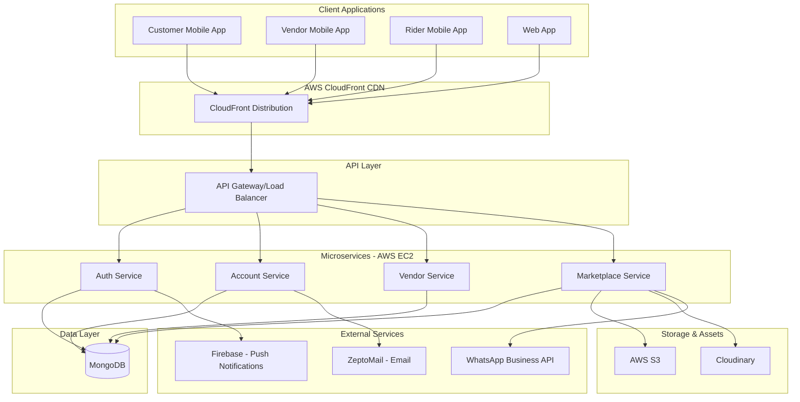
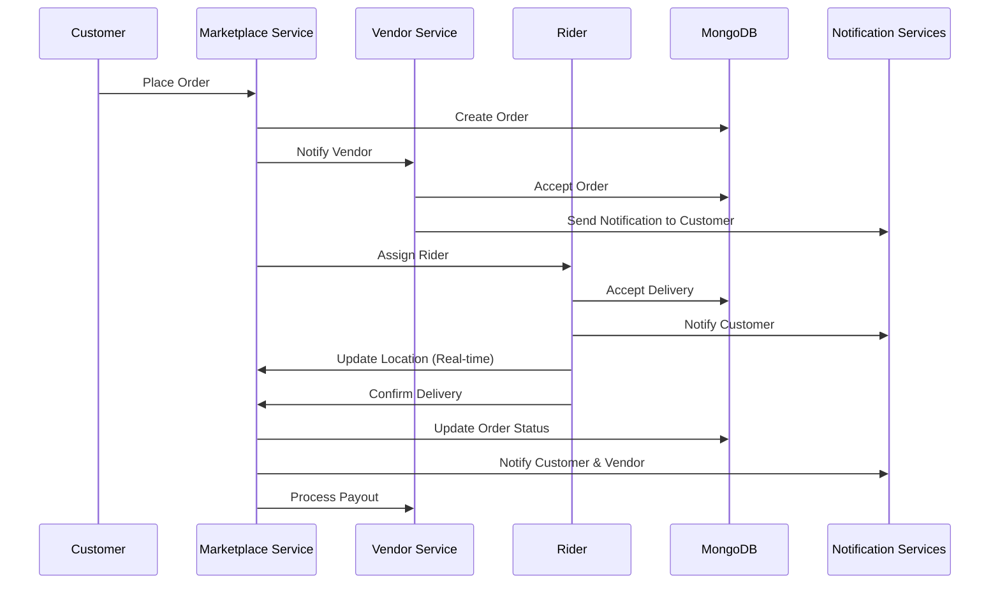
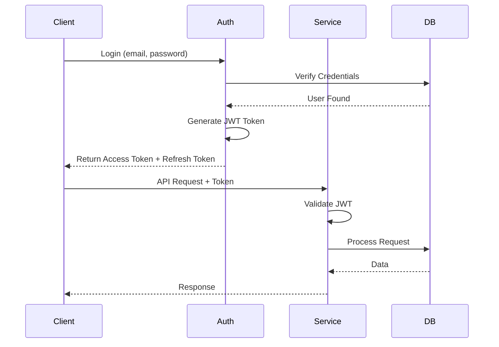

# TukShopp System Architecture

**Version:** 1.0  
**Last Updated:** November 11, 2025  
**Status:** Production

---

## 📋 Overview

TukShopp is built on a microservices architecture deployed on AWS infrastructure. The system handles the complete delivery workflow from vendor management to customer orders, rider delivery, and vendor payouts.

### Key Services
- **Auth Service** - Authentication and authorization
- **Account Service** - User account management
- **Vendor Service** - Vendor operations and management
- **Marketplace Service** - Orders, delivery, and marketplace operations

**API Documentation:** [https://api.tukshopp.ng/docs/](https://api.tukshopp.ng/docs/)

---

## 🏗️ High-Level Architecture



---

## 🔧 Technology Stack

### Backend
- **Runtime:** Node.js / [Programming Language]
- **Framework:** Express.js / [Framework]
- **Language:** JavaScript/TypeScript

### Database
- **Primary Database:** MongoDB
- **Type:** NoSQL Document Database
- **Hosting:** [MongoDB Atlas / Self-hosted]
- **Replication:** [Replica set configuration]

### Cloud Infrastructure (AWS)
- **Compute:** EC2 instances
- **CDN:** CloudFront
- **Storage:** S3
- **Web Hosting:** Lightsail (if applicable)
- **Version Control:** GitHub

### Media & Assets
- **Image Storage:** Cloudinary
- **CDN:** AWS CloudFront + Cloudinary CDN

### Communication Services
- **Email:** ZeptoMail
- **SMS/WhatsApp:** Facebook WhatsApp Business API
- **Push Notifications:** Firebase Cloud Messaging (FCM)

### Development & Deployment
- **Version Control:** GitHub
- **CI/CD:** GitHub Actions
- **Monitoring:** [Tool name]
- **Logging:** [Tool name]

---

## 🎯 Architecture Principles

### Microservices Design
- **Service Independence** - Each service can be deployed independently
- **Domain-Driven Design** - Services organized by business domain
- **API-First** - RESTful APIs for all services
- **Stateless Services** - Services don't maintain session state

### Scalability
- **Horizontal Scaling** - Add more EC2 instances as needed
- **Database Scaling** - MongoDB sharding for data distribution
- **CDN Caching** - Static assets served via CloudFront
- **Load Balancing** - Distribute traffic across instances

### Reliability
- **Service Isolation** - Failure in one service doesn't affect others
- **Graceful Degradation** - System continues operating with reduced functionality
- **Health Checks** - Regular health monitoring of all services
- **Database Replication** - Data redundancy with replica sets

### Security
- **Authentication** - JWT token-based authentication
- **Authorization** - Role-based access control (RBAC)
- **Data Encryption** - Encrypted at rest and in transit
- **API Security** - Rate limiting, input validation
- **HTTPS Only** - All communications over TLS/SSL

---

## 📦 Service Architecture

### Auth Service
**Responsibility:** Authentication and authorization  
**Base URL:** `https://api.tukshopp.ng/auth`  
**Swagger:** [https://api.tukshopp.ng/docs/auth-service](https://api.tukshopp.ng/docs/auth-service)

**Key Functions:**
- User registration and login
- JWT token generation and validation
- Password reset and recovery
- OAuth integration
- Session management

**Dependencies:**
- MongoDB (user credentials, tokens)
- ZeptoMail (verification emails)
- Firebase (push notifications for security alerts)

---

### Account Service
**Responsibility:** User account and profile management  
**Base URL:** `https://api.tukshopp.ng/account`  
**Swagger:** [https://api.tukshopp.ng/docs/account-service](https://api.tukshopp.ng/docs/account-service)

**Key Functions:**
- Profile management (customers, vendors, riders)
- Address management
- Payment methods
- Wallet management
- Preferences and settings

**Dependencies:**
- MongoDB (user profiles, addresses, payment methods)
- Cloudinary (profile images)
- S3 (document storage)

---

### Vendor Service
**Responsibility:** Vendor operations and business management  
**Base URL:** `https://api.tukshopp.ng/vendor`  
**Swagger:** [https://api.tukshopp.ng/docs/vendor-service](https://api.tukshopp.ng/docs/vendor-service)

**Key Functions:**
- Outlet management
- Menu/catalog management
- Order processing for vendors
- Inventory tracking
- Analytics and reporting
- Vendor payouts

**Dependencies:**
- MongoDB (vendors, outlets, menus, orders)
- Cloudinary (menu item images)
- S3 (vendor documents, reports)
- Firebase (order notifications)

---

### Marketplace Service
**Responsibility:** Order management, delivery, and marketplace operations  
**Base URL:** `https://api.tukshopp.ng/marketplace`  
**Swagger:** [https://api.tukshopp.ng/docs/marketplace-service](https://api.tukshopp.ng/docs/marketplace-service)

**Key Functions:**
- Order placement and management
- Rider-order matching
- Delivery tracking
- Pickup & delivery requests
- Search and discovery
- Ratings and reviews
- Payment processing

**Dependencies:**
- MongoDB (orders, deliveries, ratings)
- Firebase (real-time location tracking, notifications)
- WhatsApp API (delivery notifications)
- S3 (delivery proof photos)

---

## 💾 Data Architecture

### MongoDB Collections

#### Core Collections
- **users** - User accounts (all types)
- **profiles** - User profiles with type-specific data
- **vendors** - Vendor business information
- **outlets** - Vendor outlet locations
- **menu_items** - Product catalogs
- **orders** - Order records
- **deliveries** - Delivery tracking
- **transactions** - Payment transactions
- **wallets** - User wallet balances
- **notifications** - Notification history

#### Relationship Patterns
- **One-to-Many:** User → Orders, Vendor → Outlets
- **Many-to-Many:** Orders → MenuItems (via order_items)
- **References:** MongoDB ObjectId references
- **Embedded Documents:** Addresses, order items

### Data Flow



---

## 🌐 Infrastructure Architecture

### AWS Infrastructure

#### Compute (EC2)
- **Instance Types:** [t2.medium, t3.large, etc.]
- **Auto Scaling:** Configured based on traffic
- **Availability Zones:** Multi-AZ deployment
- **Security Groups:** Configured for each service

#### Content Delivery (CloudFront)
- **Distributions:** 
  - API endpoints caching
  - Static assets (images, CSS, JS)
- **Edge Locations:** Global distribution
- **Cache Behaviors:** Configured per content type
- **Origin:** EC2 instances + S3

#### Storage (S3)
- **Buckets:**
  - `tukshopp-documents` - User documents
  - `tukshopp-reports` - Generated reports
  - `tukshopp-backups` - Database backups
- **Lifecycle Policies:** Auto-archiving old files
- **Versioning:** Enabled for critical buckets

#### Lightsail
- **Usage:** [Specify if used for web hosting or other purposes]
- **Resources:** [List resources if applicable]

### Cloudinary
- **Media Management:** Images for menu items, profiles, vendors
- **Transformations:** On-the-fly image optimization
- **CDN:** Global delivery network
- **Storage:** Cloud-based image storage

---

## 🔌 External Integrations

### Firebase
**Usage:** Push notifications, real-time database (if used)

**Features:**
- **FCM (Firebase Cloud Messaging):** Push notifications to mobile apps
- **Real-time Database:** Live location tracking for riders
- **Analytics:** User behavior tracking

**Configuration:**
- Server key stored in environment variables
- Client SDKs in mobile apps

---

### ZeptoMail
**Usage:** Transactional email service

**Email Types:**
- Welcome emails
- Order confirmations
- Password resets
- Payout notifications
- Marketing campaigns

**Configuration:**
- API key authentication
- Templates configured in ZeptoMail dashboard

---

### WhatsApp Business API (Facebook)
**Usage:** Customer notifications and communication

**Use Cases:**
- Order status updates
- Delivery notifications
- Customer support
- Promotional messages

**Configuration:**
- WhatsApp Business API credentials
- Webhook for incoming messages
- Template messages for notifications

---

## 🔒 Security Architecture

### Authentication Flow


### Security Layers
1. **Network Security**
   - HTTPS/TLS for all communications
   - AWS Security Groups
   - VPC configuration

2. **Application Security**
   - JWT token validation
   - Role-based access control
   - Input validation and sanitization
   - Rate limiting

3. **Data Security**
   - Encrypted database connections
   - Encrypted storage (S3, MongoDB)
   - PCI-DSS compliance for payments
   - Secure credential storage

---

## 📊 Monitoring & Logging

### Health Monitoring
- **Service Health Checks:** Regular endpoint checks
- **Database Monitoring:** Connection pool, query performance
- **Infrastructure Monitoring:** CPU, memory, disk usage
- **API Monitoring:** Response times, error rates

### Logging Strategy
- **Application Logs:** Service-level logs
- **Access Logs:** API request/response logs
- **Error Logs:** Exception and error tracking
- **Audit Logs:** Security and compliance events

### Tools
- **Monitoring:** [CloudWatch, DataDog, New Relic, etc.]
- **Logging:** [CloudWatch Logs, ELK Stack, etc.]
- **Error Tracking:** [Sentry, Rollbar, etc.]
- **APM:** [Application Performance Monitoring tool]

---

## 🚀 Deployment Architecture

### Environments
- **Development:** Local and dev server
- **Staging:** Pre-production testing
- **Production:** Live production system

### CI/CD Pipeline
```
GitHub Commit → GitHub Actions → Build → Tests → Deploy to EC2 → Health Check
```

### Deployment Strategy
- **Blue-Green Deployment:** Zero-downtime deployments
- **Rolling Updates:** Gradual service updates
- **Rollback Capability:** Quick rollback on failures

---

## ⚡ Performance Optimization

### Caching Strategy
- **CDN Caching:** Static assets via CloudFront
- **API Caching:** Frequently accessed data
- **Database Indexing:** Optimized queries
- **Image Optimization:** Cloudinary transformations

### Load Balancing
- **Application Load Balancer:** Distribute API traffic
- **Database Read Replicas:** Distribute read operations
- **Geographic Distribution:** CloudFront edge locations

---

## 📈 Scalability Considerations

### Current Capacity
- **API Requests:** [X] requests/second
- **Concurrent Users:** [Y] users
- **Database Size:** [Z] GB

### Scaling Strategy
- **Horizontal Scaling:** Add EC2 instances
- **Database Sharding:** MongoDB sharding for data distribution
- **Caching Layers:** Redis/Memcached for performance
- **Microservices Split:** Further service decomposition as needed

---

## 🔄 Disaster Recovery

### Backup Strategy
- **Database Backups:** Daily automated backups
- **S3 Versioning:** File version history
- **Configuration Backups:** Infrastructure as Code

### Recovery Procedures
- **RTO (Recovery Time Objective):** [X hours]
- **RPO (Recovery Point Objective):** [Y hours]
- **Failover Process:** [Steps for failover]

---

## 📚 Related Documentation

- [Microservices Details](./microservices.md)
- [Database Design](./database-design.md)
- [Infrastructure Setup](./infrastructure.md)
- [Security Architecture](./security-architecture.md)
- [Service Specifications](../services/)
- [Integration Details](../integrations/)

---

## 📝 Architecture Decisions

Major architecture decisions are documented as ADRs in:
→ [`design-docs/architecture-decisions/`](../../design-docs/architecture-decisions/)

---

**Maintained by:** Engineering Leadership Team  
**Review Frequency:** Quarterly

